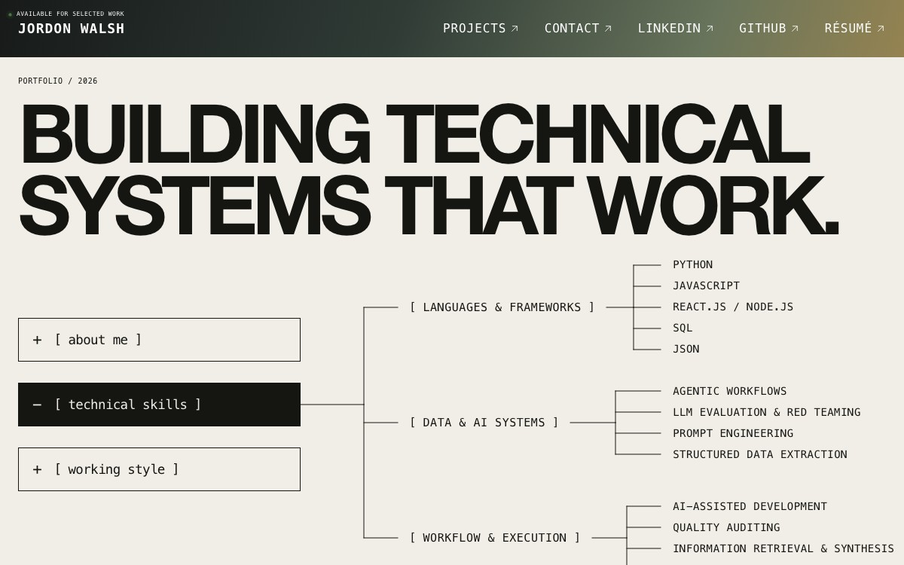

  

<h1 align="center">Jordon Walsh — Portfolio</h1>

  An interactive portfolio focused on who I am, how I work, what I build,
  and the projects that demonstrate it.

## The portfolio

This portfolio puts the useful information first. The opening screen works like
a compact technical map: **About Me**, **Technical Skills**, and **Working Style**
expand in place, with the selected project index immediately below.

The experience is designed to let visitors understand my background, scan my
technical strengths, see how I approach a problem, and move directly into the
work without navigating through conventional résumé pages.

## Interaction system

| Surface | Experience |
| --- | --- |
| Opening sequence | A staggered column reveal introduces the page while my name remains anchored in the header. |
| Information trees | Orthogonal branches build outward from the selected topic and reverse cleanly when closed. |
| Project index | Editorial project layouts combine scroll-triggered motion with a restrained green-to-gold visual system. |
| Project pages | Each project opens into a focused full-screen presentation with its own artwork and motion. |
| Reduced motion | Visitors who prefer reduced motion receive the same information without the choreography. |

## Selected work

### GRVL

GRVL opens with a delayed, chrome-free project film that plays once and rests
on its final frame, allowing the visual identity to remain present while the
project details are explored.

### FleetSync

FleetSync features a custom nautilus mark whose SVG paths assemble from the
center outward. The animation can be replayed from within the project page.

## Built with

The portfolio combines React, TypeScript, GSAP, responsive CSS, and animated
SVG geometry. It is published as a fully static site through GitHub Pages at
the root of its custom domain.

The portfolio is actively evolving. GRVL and FleetSync contain custom media
treatments, while Projects 03 and 04 preserve the final interaction and layout
for work currently being prepared.
